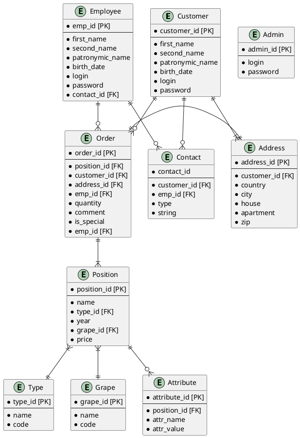

# Database ER Diagram

```plantuml
@startuml

entity Customer {
    * customer_id [PK]
    --
    * first_name
    * second_name
    * patronymic_name
    * birth_date
    * login
    * password
}

entity Admin {
    * admin_id [PK]
    --
    * login
    * password
}

entity Employee {
    * emp_id [PK]
    --
    * first_name
    * second_name
    * patronymic_name
    * birth_date
    * login
    * password
    * contact_id [FK]
}

entity Position {
    * position_id [PK]
    --
    * name
    * type_id [FK]
    * year
    * grape_id [FK]
    * price
}

entity Type {
    * type_id [PK]
    --
    * name
    * code
}

entity Grape {
    * grape_id [PK]
    --
    * name
    * code
}

entity Attribute {
    * attribute_id [PK]
    --
    * position_id [FK]
    * attr_name
    * attr_value
}

entity Order {
    * order_id [PK]
    --
    * position_id [FK]
    * customer_id [FK]
    * address_id [FK]
    * emp_id [FK]
    * quantity
    * comment
    * is_special
    * emp_id [FK]
}

entity Address {
    * address_id [PK]
    --
    * customer_id [FK]
    * country
    * city
    * house
    * apartment
    * zip
}

entity Contact {
    * contact_id
    --
    * customer_id [FK]
    * emp_id [FK]
    * type
    * string
}

Order ||--|{ Position
Order ||-|| Address

Customer ||--|{ Address
Customer ||--o{ Order
Customer ||--o{ Contact

Employee ||--o{ Contact
Employee ||--o{ Order

Position ||--o{ Attribute
Position }|--|| Grape
Position }|--|| Type


@enduml
```
