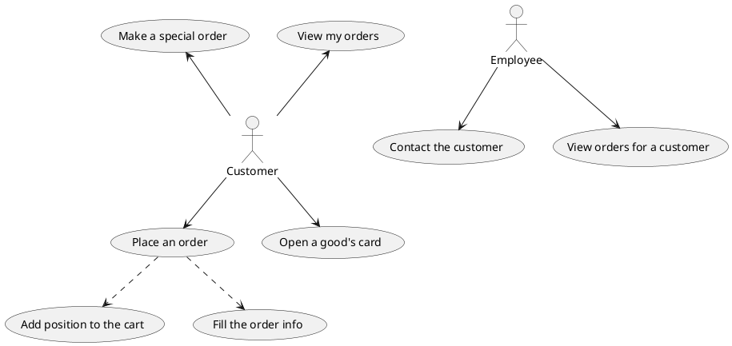

# Use cases of the product

```plantuml
@startuml

:Employee:

:Customer:

(Place an order) as order
(Open a good's card) as open_card
(Add position to the cart) as add_to_cart
(Fill the order info) as fill_info
(Contact the customer) as contact_cust
(View orders for a customer) as view_cust_orders
(View my orders) as view_orders
(Make a special order) as make_special

Customer -down-> order
Customer -up-> view_orders
Customer -up-> make_special
Customer -down-> open_card

order ..> add_to_cart
order ..> fill_info

Employee --> contact_cust
Employee --> view_cust_orders

@enduml
```